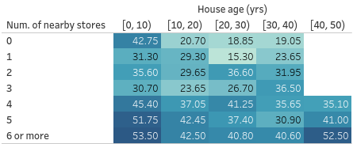

```{r echo=FALSE, message=FALSE, warning=FALSE}
library(tidyverse)
library(readxl)
```

The dataset `taiwan_dataset.csv` contains locations and pricing information on
properties in the Xindian district of Taiwan. This dataset contains 414 rows and
12 columns. 

* The eleven inputs are as follows:
    * id: a row identifier
    * trans_date: the transaction date (for example, 2013.250=2013 March, 2013.500=2013 June, etc.)
    * house_age: the house age (unit: year)
    * dist_MRT: the distance to the nearest MRT station (unit: meter) 
    * num_stores: the number of convenience stores in the living circle on foot (integer)
    * lat, long: the geographic coordinates. (unit: degree)
    * X, Y: the longitude and latitude projected onto 2D (unit: metres)
    * Xs, Ys: the centred X and Y (unit: km)
* The output variable is as follows:  
    * price: house price of unit area (10000 New Taiwan Dollar/Ping, where Ping is
    a  local unit, 1 Ping = 3.3 meter squared)

## Question 1

In a week or two, we shall begin working on Tableau - a widely used software in the 
industry for visualisation. Here is a particular type of graphic from that software
for this dataset. It is known as a highlight table. Re-create this with ggplot 
as closely as you can.

```{r echo=FALSE, fig.align='center', out.width="40%"}

```

Here is my best attempt:

```{r fig.align='center', out.width='40%', echo=FALSE}
tw <- read.csv("../data/taiwan_dataset.csv")
tw <- mutate(tw, stores_coded = if_else(num_stores >=6, 6L, num_stores),
             house_age_cat = cut(house_age, breaks=c(0, 10, 20, 30, 40, 50),
                                 include.lowest = TRUE, right=FALSE))

#tw  %>% group_by(stores_coded, house_age_cat) %>%
#  summarise(y_med = median(price), .groups="drop") %>%
#  pivot_wider(names_from="house_age_cat", values_from="y_med")

tw  %>% group_by(stores_coded, house_age_cat) %>%
  summarise(y_med = median(price), .groups="drop") %>%
  mutate(y_col=ifelse(y_med <= 32, "b", "w")) %>%
  ggplot(aes(x=house_age_cat, y=stores_coded)) + geom_tile(aes(fill=y_med)) +
  geom_text(aes(label=sprintf(fmt = "%.2f", y_med), col=y_col), show.legend = FALSE) +
  scale_y_reverse(labels=c(0:5, "6 or more"), breaks=0:6) +
  scale_color_manual(values=c("b"="black", "w"="white")) +
  #scale_y_reverse() +
  scale_fill_continuous(low="#56B1F7", high="#132B43") +
  scale_x_discrete(position="top")  +
  theme_minimal() +
  #scale_fill_continuous(trans="reverse") +
  labs(x="House age (yrs)\n", y="Num. of stores", fill="Median house price") +
  theme(legend.position="bottom")
```

## Question 2

Let us focus on the distance to MRT variable. Create a scatter plot of price
versus distance to MRT. Now take a (natural) log transformation of distance to
MRT.

> *The transformation has helped to "straighten" out the plot.*

We are going to fit a straight line $y = b x + a$ to this transformed data, where 
$x$ is the log-transformed distance to MRT and $y$ is price. We are going to 
estimate the slope $b$ and the intercept $a$ using this algorithm:

1. Consider all pairs of points $(x_i, y_i)$ and $(x_j, y_j)$ such that 
$1 \le i < j \le 414$ and $x_i \ne x _j$. Suppose there are $N$ such pairs.
2. Compute the slope for the $N$ pairs and take the median. This is our 
estimate of the slope $\hat{b}$.
3. Compute $a_i = y_i - \hat{b} x_i$ and take the median. This is our estimate 
of the intercept $\hat{a}$.

This approach uses medians, so it is less influenced by "wild" points. Write a
function `pairwise_median_lm(x,y)` that takes two vectors `x` and `y` and
returns a vector of length two containing the slope and the intercept (in that
order) using the algorithm above.

Compute the slope and intercept for the Taiwan data using the log-distance and 
price variables. Compare your output to a traditional linear model. How does it 
differ? 

## Question 3 

Here is a plot of the locations of the properties in Taiwan. After studying it,
I choose the "centre of town" to be $(Xs,Ys) = (0.5, 0.5)$. Create a new 
column in your dataset that is the Euclidean distance to the centre of town. Create 
a scatter plot of price versus "distance to centre of town". Experiment with different 
transformations to straighten out the plot, and then fit a resistant line to your 
plot using the function above.

```{r, fig.align='center', out.width='50%', echo=FALSE}
knitr::include_graphics("../figs/tut09_taiwan.png")
```

## Learning Points

1. When we explore data, we would like to use resistant methods, that are not 
easily influenced by "wild" points.
2. Resistant methods are plenty; many rely on medians, and are computationally 
intensive.
3. Transformations can help to straighten out a plot. It's up to us to find one,
and then to interpret them as best we can.
4. ggplot provides very low-level control of elements; we can re-create many 
graphics we come across.

## Requirements

1. At least three graphics, one for each question above.
2. A function `pairwise_median_lm` that takes in two arguments, named `x` and 
`y` and returns a vector of length 2.